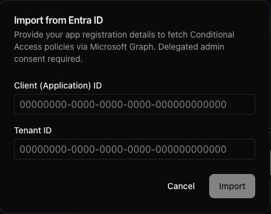

# Next.js Entra ID Conditional Access Policies Visualizer

## Disclaimer
This project was created with the assistance of GitHub Copilot. Portions of the code, structure, and documentation were generated and then reviewed/edited by a human. Please validate and test in your environment and review results before relying on them.

This is a proof of concept, not a thoughtfully designed and developed application. It may contain bugs, inefficiencies, and incomplete features.

If you use Entra ID with this app, ensure appropriate security and governance are in place per your organization’s policies (for example, review permissions and consent before use).

Browser-only runtime: This app runs entirely in the browser (client-side). It does not require or store server-side secrets. Authentication uses MSAL popup flows, and tokens are held in session storage for the current session. All imported policy data (CSV uploads or Entra Graph results) is processed client-side only and is not sent to any backend by this app.

## Overview
This app helps you explore Microsoft Entra ID Conditional Access (CA) policies visually. You can import policies from a CSV export or fetch them directly from Microsoft Graph with delegated auth, then inspect relationships, filter by attributes, and focus on specific policies using a graph view.

Typical uses:
- Quickly grasp each policy’s scope and relationships—who/what it applies to, key conditions (identities, applications, locations, device/platform/client apps), and grant/session controls
- Compare and filter policies, highlight one policy, and assign distinct colors per policy
- Share screenshots of your tenant’s CA topology for reviews and documentation

## Features
- Visual graph of CA policies and their related entities (users, groups, roles, apps, named locations)
- Two import paths:
  - CSV upload with configurable delimiter and column mappings
  - Direct Entra import via Microsoft Graph using MSAL popup sign-in
- Powerful filtering (AND/OR) and per-policy highlighting/coloring
- Modern UI with sidebar selection and responsive canvas rendering

## Tech stack
- Next.js (App Router, TypeScript, Turbopack)
- Tailwind CSS
- MSAL Browser + Microsoft Graph for Entra import
- Jest for unit tests, ESLint for linting

## Screenshots
Add your own screenshots to replace the placeholders below. Place images in `docs/screenshots/` so they don’t ship with the app.

1. Landing state (no data)

   

2. CSV import and configuration

   
   

3. Entra import (MSAL popup + Graph fetch)

   

4. Graph visualization with filters

   

## Getting Started

1. Install dependencies:
   ```sh
   npm install
   # or
   pnpm install
   ```
2. Run the development server:
   ```sh
   npm run dev
   # or
   pnpm dev
   ```
3. Build for production:
   ```sh
   npm run build
   # or
   pnpm build
   ```

## Usage
- Upload CSV: Click “Upload CSV File” on the landing card, then configure delimiter and column mapping in the modal.
- Import from Entra: Click “Import from Entra”, enter your Client ID and Tenant ID, complete MSAL popup sign-in, and the app will fetch policies via Graph.
- Explore: Use the sidebar to select policies, set colors, and filter. The canvas updates to reflect the selected/filtered set.

## Required permissions for Entra import
- Microsoft Graph (Delegated):
   - `Policy.Read.All` — Read Conditional Access policies
   - `Directory.Read.All` — Read directory data (users, groups, roles, applications, service principals)
- Admin consent: Required for both permissions. A tenant admin must grant consent before use.
- App registration: Register a Single-page application (SPA) and set the Redirect URI(s) to your app origins, for example:
   - Local development: `http://localhost:3000`
   - Production (Vercel): `https://entra-ca-policy-vizz.vercel.app`


## License
This project is released under the MIT License. See `LICENSE` for details.